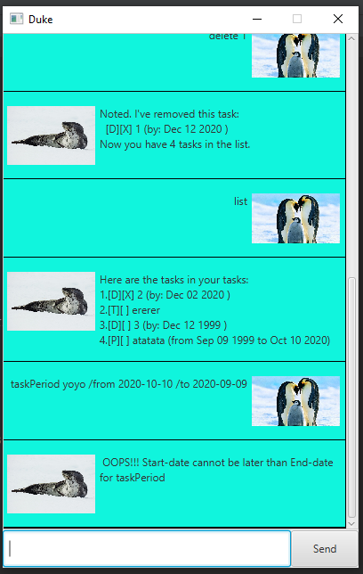

# User Guide

Duke is a **desktop app** that acts as a task manager through a
Graphical User Interface (GUI). Keep track of your tasks such as events and
deadlines easily with Duke.

## Table of Contents
- [Table of Contents](#table-of-contents)
- [Quick start](#quick-start)
- [Features](#features)
    - [Tasks](#Tasks)
        - [Adding a todo task: `todo`](#todo-todo)
        - [Adding a deadline task: `deadline`](#deadline-deadline)
        - [Adding an event task: `event`](#event-event)
        - [Adding an taskPeriod task: `taskPeriod`](#taskperiod-taskperiod)
    - [List : `list`](#list-list)
    - [Find : `find`](#find-find)
    - [Mark a task as done: `done`](#mark-a-task-as-done-done)
    - [Delete : `delete`](#delete-delete)
    - [Exit : `bye`](#exit-bye)
- [FAQ](#faq)
- [Command summary](#command-summary)

--------------------------------------------------------------------------------------------------------------------

## Quick start

1. Ensure you have Java `11` or above installed in your Computer.

1. Download the latest `Duke.jar` from [here](https://github.com/Samuel-bit-prog/ip/releases).

1. Copy the file to the folder you want to use as the _home folder_ for the task manager.

1. Double-click the file to start the app. The GUI similar to the below should appear in a few seconds. Note how the 
   app contains some sample data. 
   

1. Type the command in the command box and press Enter to execute it. e.g. typing **`help`** and pressing 
   Enter will open the help window. 
   Some example commands you can try:

    * **`list`** : Lists down all the tasks in the task manager.

    * **`todo`**`shopping for presents` : Adds a todo task with the description 'shopping for presents'.

    * **`delete`**`3` : Deletes the 3rd task in the list.

    * **`done`**`1` : Marks the first task as done.

    * **`bye`** : Exits the app. Data will be saved in a text file.

1. Refer to the [Features](#features) below for details of each command.

--------------------------------------------------------------------------------------------------------------------

## Features

### Tasks

#### Todo: `todo`

Adds a todo task to the task list.

Format: `todo DESCRIPTION`
* The `DESCRIPTION` refers to the todo task description.

Examples:
* `todo cooking lunch`

#### Deadline: `deadline`

Adds a deadline task to the task list.

Format: `deadline DESCRIPTION /by YYYY-MM-DD`
* The `DESCRIPTION` refers to the deadline task description.
* `YYYY-MM-DD` refers to the date the task is due.

Examples:
* `deadline buy shoes /by 2020-10-10`

#### Event: `event`

Adds an event task to the task list.

Format: `event DESCRIPTION /at YYYY-MM-DD`
* The `DESCRIPTION` refers to the event task description.
* `YYYY-MM-DD` refers to the date of the event.

Examples:
* `event wedding /at 2020-08-07`

#### TaskPeriod: `taskPeriod`

Adds a task with a time period to the task list.

Format: `taskPeriod DESCRIPTION /from YYYY-MM-DD /to YYYY-MM-DD`
* The `DESCRIPTION` refers to the description of the task.
* `YYYY-MM-DD` refers to the dates for the period.

Examples:
* `taskPeriod massive discount /from 2020-09-09 /to 2020-10-01`

### List: `list`

Displays a list of all the tasks in the `./Data/duke.txt` file. `[T]` means a todo task,
`[D]` means deadline task,`[E]` means event task and `[P]` means a task with a period.
An `[x]` next to the letter will indicate the task as completed while `[ ]` means uncompleted.

Format: `list`

Example of how a task looks in list:
* `[P][ ] read book (from Oct 10 2020 to Oct 11 2020)` represents a task
  with a period
  
### Find: `find`

Find tasks that contain the keyword and display them.

Format: `find KEYWORD`
* The `KEYWORD` refers to the word that the tasks have to contain.

### Mark a task as done: `done`
Marks the specified task as done. They will now appear with `[x]` when 
displayed in list

Format: `done TASK_NO`

* `TASK_NO` is the number of the task to be marked as done in the task list.

Example:
* `done 3` marks the third task as completed.

### Delete: `delete`

Deletes the specified task from the task manager. It will no longer appear in list.

Format: `delete TASK_NO`

* `TASK_NO` is the number of the task to be deleted.

Example:
* `delete 1` deletes the first task.

### Exit: `bye`

Entering `bye` closes and exits Duke. The task data will be saved to a text file in the location `./Data/duke.txt`.

Format: `bye`

--------------------------------------------------------------------------------------------------------------------

## FAQ

**Q**: How do I transfer my data to another Computer? 
**A**: Install the app in the other computer and overwrite the empty data file it creates with the file that contains 
the data of your previous home folder for Duke.

--------------------------------------------------------------------------------------------------------------------

## Command summary

Action | Format, Examples
--------|------------------
**todo** | `todo DESCRIPTION`   e.g., `todo cooking lunch`
**deadline** | `deadline DESCRIPTION /by YYYY-MM-DD`   e.g., `deadline buy shoes /by 2020-10-10`
**event** | `event DESCRIPTION /at YYYY-MM-DD`   e.g., `event wedding /at 2020-08-07`
**taskPeriod** | `taskPeriod DESCRIPTION /from YYYY-MM-DD /to YYYY-MM-DD`   e.g.,`taskPeriod massive discount/from 2020-09-09 /to 2020-10-01`
**list** | `list`
**find** | `find KEYWORD`   e.g., `find book`
**done** | `done TASK_NO`   e.g., `done 1`
**delete** | `delete TASK_NO`  e.g.,`delete 5`
**bye** | `bye`
